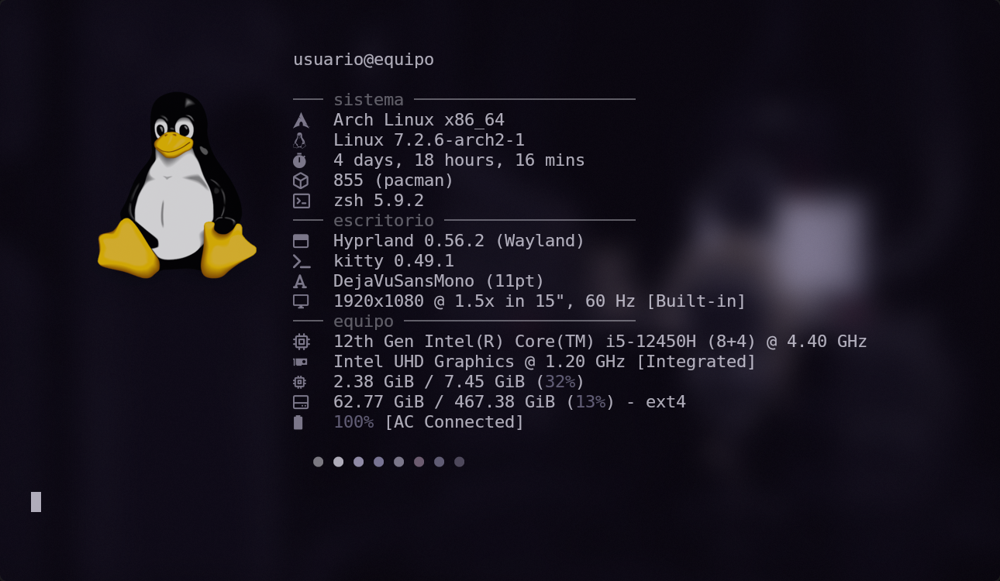
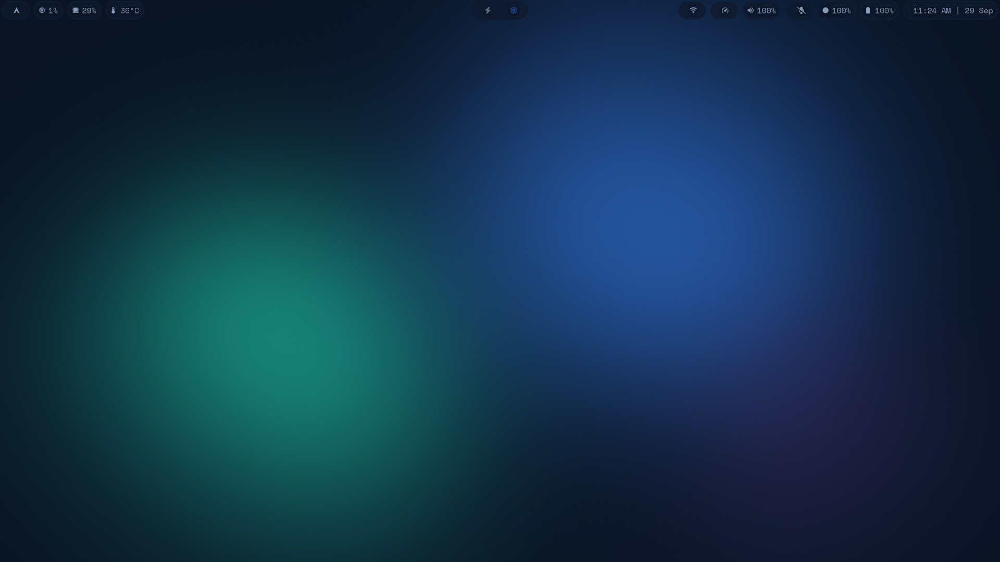
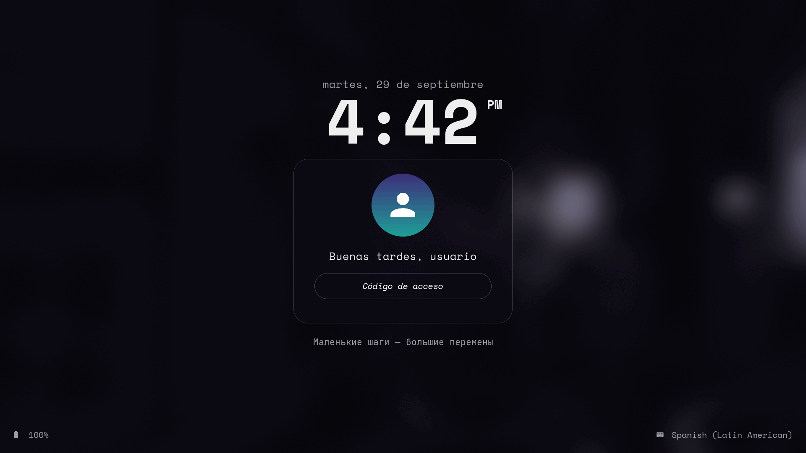
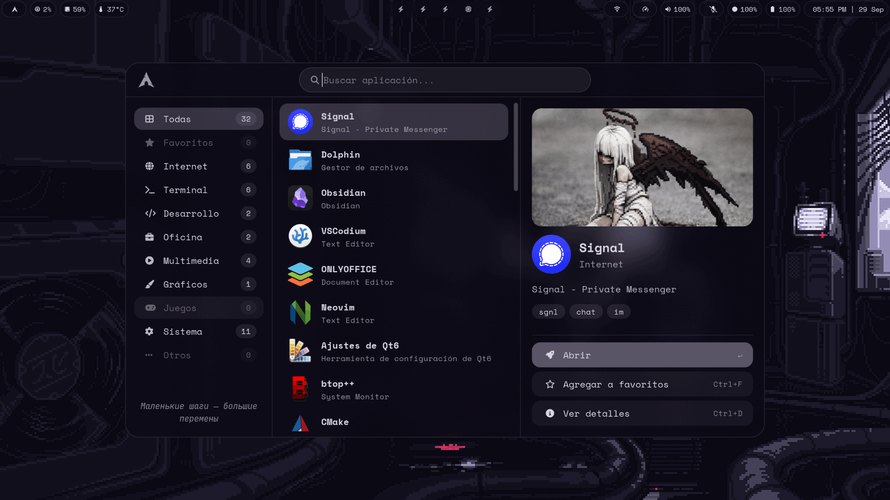
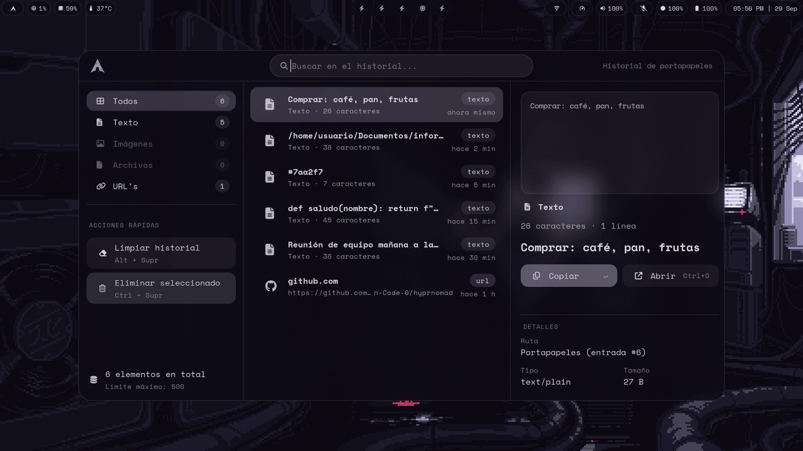
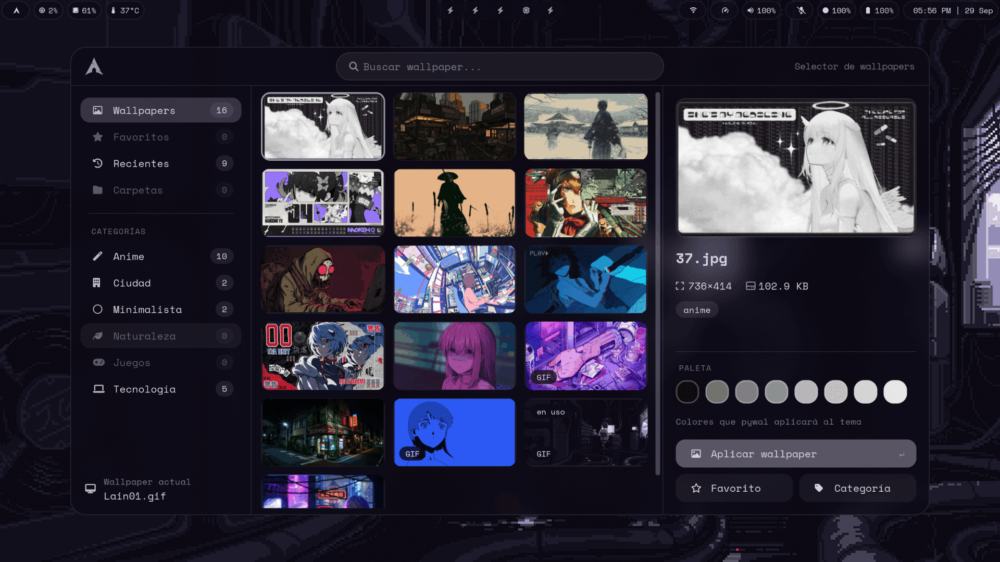
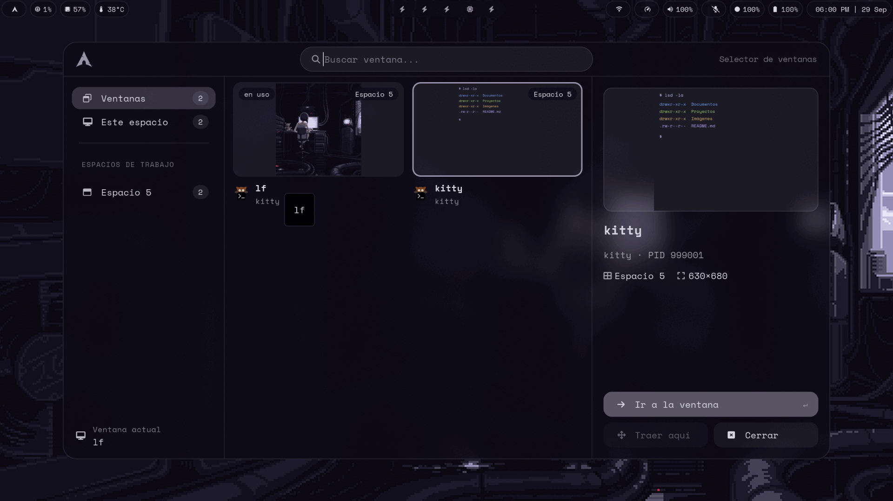
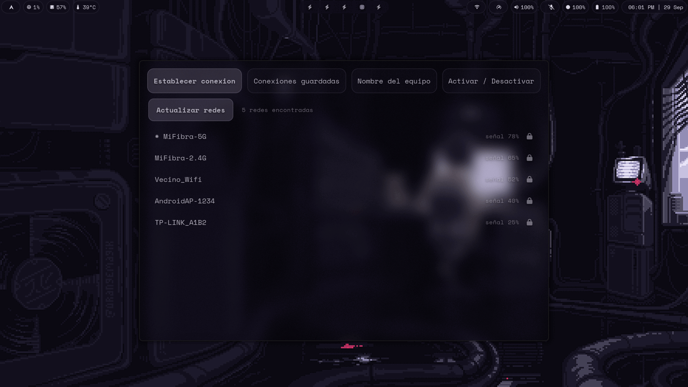
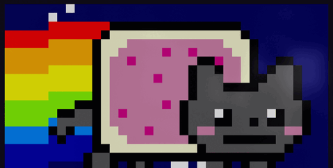

<h1 align="center">hyprnomad</h1>

---



<p align="center">
  
  
</p>

> [!NOTE]
> `install.sh` backs up anything it replaces in `~/.config` automatically, but making your own copy of your current setup first costs nothing.

English (this file) · [Español](README.es.md)

Configuring and customizing the Hyprland desktop with pywal colors. A full Arch Linux +
Hyprland setup — hyprlock, waybar, swaync, wlogout, and a handful of custom GTK3 apps
(launcher, clipboard history, wallpaper picker, window picker, wifi panel) — where the color
palette comes from the current wallpaper and gets applied everywhere.

The configuration, its comments and every app's text are written in Spanish, since the
project is built for Spanish speakers. This README is in English so it's discoverable; using
the setup itself means reading (or translating) Spanish.

## Software

**Base**

| | |
|---|---|
| OS | Arch Linux |
| Compositor | Hyprland |
| Session | uwsm |
| Bar | Waybar |
| Terminal | kitty |
| Shell | Zsh + Oh My Zsh + Powerlevel10k |
| Lock / idle | hyprlock / hypridle |
| Notifications | SwayNC |

**Input & UI**

| | |
|---|---|
| Launcher | custom, GTK3 + gtk-layer-shell |
| Clipboard | cliphist + custom GTK3 UI |
| Wallpaper picker | custom GTK3 UI |
| Window picker | custom GTK3 UI |
| Wifi panel | custom GTK3 UI, NetworkManager |
| Power menu | wlogout |
| Color scheme | pywal |
| Fonts | SpaceMono Nerd Font, JetBrainsMono Nerd Font |

**Utilities**

| | |
|---|---|
| File manager | lf |
| System info | fastfetch |
| Disk automount | udiskie |
| `ls` / `cat` replacement | lsd / bat |
| Wallpaper daemon | awww |

**Multimedia**

| | |
|---|---|
| Volume | pamixer |
| Audio mixer (GUI) | pavucontrol |
| Media keys | playerctl |
| Screenshots | grim, hyprshot |
| Image processing | ImageMagick |

## Apps

Five GTK3 apps built for this setup, replacing rofi/wofi-based launchers and pickers.

<table>
<tr>
<td align="center" width="20%"><br>Launcher</td>
<td align="center" width="20%"><br>Clipboard history</td>
<td align="center" width="20%"><br>Wallpaper picker</td>
<td align="center" width="20%"><br>Window picker</td>
<td align="center" width="20%"><br>Wifi panel</td>
</tr>
</table>

## Dependencies

`install.sh` checks these are present and lists what's missing, but doesn't install anything.

```sh
sudo pacman -S hyprland uwsm hyprlock hypridle waybar swaync awww kitty lf fastfetch \
  cliphist wl-clipboard grim imagemagick jq brightnessctl pamixer libnotify \
  xdg-user-dirs ffmpegthumbnailer perl-image-exiftool udisks2 lsd bat zsh \
  gtk-layer-shell python-gobject ttf-jetbrains-mono-nerd ttf-space-mono-nerd ttf-dejavu

yay -S python-pywal wlogout   # AUR
```

Only needed for `./install.sh --zshrc`: [Oh My Zsh](https://ohmyz.sh) with the
[Powerlevel10k](https://github.com/romkatv/powerlevel10k) theme and the `zsh-autosuggestions` /
`zsh-syntax-highlighting` plugins — all installed as git clones into `~/.oh-my-zsh`, not pacman
packages.

## Install

```sh
git clone https://github.com/Sebastian-Code-0/hyprnomad.git
cd hyprnomad
./install.sh --simular   # dry run: shows what it would do
./install.sh
```

Copies `config/` into `~/.config` and generates the initial pywal palette. Doesn't install any
packages.

## Shortcuts

`Super` is the Windows key. Full list, from `config/hypr/hyprland.conf`.

**Programs**

| Shortcut | Action |
|---|---|
| `Super + Enter` | Terminal (kitty) |
| `Super + Shift + Enter` | Floating terminal |
| `Super + Space` | Launcher |
| `Super + E` | File manager (lf, in kitty) |
| `Super + F` | Browser |
| `Super + Shift + V` | Clipboard history |
| `Super + Shift + A` | Wallpaper picker |
| `Super + A` | Random wallpaper |
| `Ctrl + Alt + Tab` | Window picker |
| `Super + N` | Notification center |

**Session**

| Shortcut | Action |
|---|---|
| `Super + L` | Lock screen |
| `Super + Shift + L` | Power menu (lock / suspend / restart / shutdown) |
| `Super + Shift + M` | Log out |

**Windows & workspaces**

| Shortcut | Action |
|---|---|
| `Super + Q` | Close window |
| `Super + V` | Toggle floating |
| `Super + P` | Pseudo mode (dwindle) |
| `Super + J` | Toggle split |
| `Super + arrows` | Move focus |
| `Super + 1..9, 0` | Go to workspace 1..10 |
| `Super + Shift + 1..9, 0` | Move window to workspace 1..10 |
| `Super + mouse wheel` | Cycle workspaces |
| `Super + S` / `Super + Shift + S` | Toggle / move to the special workspace |
| `Super + left/right click` (drag) | Move / resize window |

**Equipment keys** (`hypr/local.conf`, commented out by default): volume, mic, brightness,
screenshot, media keys, favorites menu.

### Inside the apps

Launcher, clipboard, wallpaper picker and window picker share the same base keys:

| Key | Action |
|---|---|
| `Esc` | Close |
| *(type)* | Search |
| `↑` `↓` | Move |
| `Enter` | Select / act |
| `Tab` / `Shift+Tab` | Switch category or section |

Extra keys per app:

| Key | Action | App |
|---|---|---|
| `Ctrl+F` | Favorite | Launcher |
| `Ctrl+D` | Details | Launcher |
| `Ctrl+O` | Open | Clipboard |
| `Ctrl+Delete` | Delete | Clipboard |
| `Alt+Delete` | Clear history | Clipboard |
| `Ctrl+T` | Categories | Wallpaper picker |
| `Ctrl+G` | Columns | Wallpaper picker |
| `Ctrl+W` | Close window | Window picker |
| `Ctrl+M` | Bring here | Window picker |
| `Ctrl+G` | Columns | Window picker |

### lf

| Key | Action |
|---|---|
| `.` | Toggle hidden files |
| `f` | Filter |
| `w` | Jump (zoxide) |
| `Ctrl+F` | Find files (fzf) |
| `bc` | Search text in files (ripgrep) |
| `x` / `y` / `p` | Cut / copy / paste |
| `bb` / `B` | Trash / delete |
| `br` / `bv` | Restore / empty trash |
| `aa` | Open |
| `Ctrl+A` | Select all |
| `cm` | Make executable |
| `cb` | Backup |
| `na` / `nd` / `ns` | New file / folder / folder from selection |
| `zc` / `za` / `ze` | Zip / encrypted zip / extract |
| `id` `im` `iv` `in` `iw` `is` | Go to Downloads / Pictures / Videos / Music / Wallpapers / Screenshots |
| `ii` / `gh` | Go home |
| `iu` / `du` | Mount / unmount USB |
| `rc` | Reload config |

Full definitions in `config/lf/configs/{keymaps,commands}`.

## Credits

- [hyprstellar](https://github.com/xeji01/hyprstellar) — one of the projects that
  inspired this setup, especially its general layout and overall feel.

Licensed under GPL-3.0.

---

<p align="center"></p>
